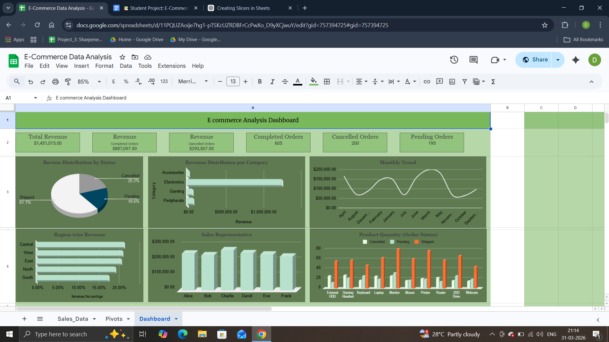

# 💰 E-Commerce-Sales-Analysis
An end-to-end E-Commerce Data Analysis project built using Google Sheets, focusing on transforming raw sales data into meaningful business insights through interactive dashboards and pivot analysis.

 

## ❓ Problem Statement
E-commerce businesses generate large volumes of raw sales data, making it difficult to extract meaningful insights.
This project focuses on cleaning and transforming unstructured data into a structured format for analysis,an interactive dashboard is built to track key metrics like revenue, order status, and sales performance.The goal is to enable data-driven decision-making and identify trends, opportunities, and inefficiencies.

 

## 📚 Data Overview :
- Data : E-Commerce Website Sales Data [Dataset](E_Commerce_Analysis/Raw_Dataset) (2024 - 2025)
- Source : Kaggle
- Size : 1000 rows as records and 10 Columns as Fields.

 

## 🧹 Data Cleaning & Preparation :
- Handled Duplicates and Null Values
- Created an Order Type based on revenue.
- Conditional Formatting for easily differentiating Order Status.

 

## 🎯 Exploratory Data Analysis (EDA)
- Total Revenue genearted is $ 1,450,15.
- Order Status Quantity
  - Shipped : 605
  - Pending : 195
  - Cancelled : 200
- Region wise revenue :
  - Central	21.43%
  - West	20.98%
  - East	20.67%
  - North	19.31%
  - South	17.61%

 

## 💻 Dashboard

### [Sheet File](E_Commerce_Analysis/E_Commerce_DataAnalysis.xlsx)

 

## 📌 Insights 
- Built an interactive E-commerce Dashboard using Google Sheets to track revenue, order status and sales performance.
- Analyzed sales data using Pivot Tables, identifying that shipped orders contribute the highest revenue share
- Discovered Electronics as the top-performing category, driving a major portion of total sales
- Identified seasonal revenue trends through monthly analysis, enabling better business planning
- Evaluated regional and sales representative performance, highlighting top contributors and improvement areas
- Implemented data transformation techniques, including order segmentation (High vs Standard Value) for deeper insights

 

## ⚒ Tools Used 
- Google Sheets

## Contact : Dhruv Sikarwar (Author)
- [Connect With me on LinkedIn](https://www.linkedin.com/in/dhruv-sikarwar-b2477a30b)

